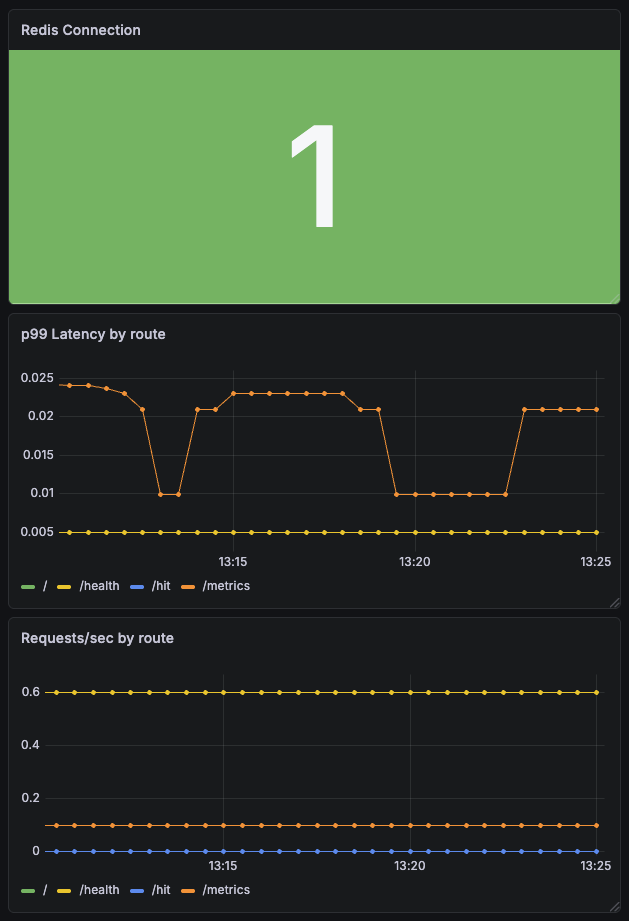

# kubecounted


A Redis-backed hit counter API built to explore real platform engineering patterns end-to-end — from containerization and multi-replica Kubernetes deployments, to a full CI/CD pipeline, to a live observability stack with Prometheus and Grafana.


*Grafana dashboard screenshot — requests/sec by route, p99 latency, and Redis connection health.*

## What this covers

- **Docker** — multi-stage build to keep the production image minimal; Docker Compose for local development
- **Kubernetes** — Deployments, Services, ConfigMaps, multi-replica scaling, self-healing, readiness and liveness probes
- **Ingress** — host-based routing via a single nginx Ingress Controller (`hit-counter.local` and `hello.local`)
- **CI/CD** — GitHub Actions builds and pushes the image to GHCR on every push to `main`, tagged with both `latest` and the commit SHA for traceability
- **Observability** — Prometheus scrapes custom app metrics (request counter, latency histogram, Redis connection gauge) via a ServiceMonitor; Helmfile codifies the entire monitoring stack as code; Grafana dashboard visualizes requests/sec, p99 latency, and Redis health

## Prerequisites

- [Node.js](https://nodejs.org/) and [pnpm](https://pnpm.io/) (for local development outside Docker)
- [Docker](https://docs.docker.com/get-docker/)
- [minikube](https://minikube.sigs.k8s.io/docs/start/) (for Kubernetes)
- [Helm](https://helm.sh/docs/intro/install/) (for installing the monitoring stack)
- [Helmfile](https://helmfile.readthedocs.io/) (for declarative Helm release management: `brew install helmfile`)

## Running with Docker Compose

Starts the Express app and Redis together:

```bash
docker compose up --build
```

The app will be available at `http://localhost:3000`.

```bash
docker compose down
```

## Running with Kubernetes (minikube)

### Starting the cluster

```bash
minikube start
```

### Deploying

Apply all manifests at once:

```bash
kubectl apply -f k8s/
```

The app image is pulled from GHCR (`ghcr.io/riccjohn/kubecounted:latest`). To pick up a new image after a CI build:

```bash
kubectl rollout restart deployment/kubecounted
```

### Checking status

```bash
kubectl get pods
```

### Ingress

Enable the ingress addon (one-time setup):

```bash
minikube addons enable ingress
```

Start a tunnel to expose the cluster on `127.0.0.1` (keep this running in a separate terminal):

```bash
minikube tunnel
```

Then access the services using the `Host` header:

```bash
curl -H "Host: hit-counter.local" http://127.0.0.1
curl -H "Host: hello.local" http://127.0.0.1
```

### Stopping

```bash
kubectl delete -f k8s/
minikube stop
```

## Monitoring

The monitoring stack (Prometheus + Grafana via `kube-prometheus-stack`) is managed declaratively with Helmfile. Install the prerequisites first:

```bash
brew install helmfile
helm plugin install https://github.com/databus23/helm-diff --verify=false
```

Deploy the stack:

```bash
helmfile apply -f helm/helmfile.yaml
```

To preview changes without applying:

```bash
helmfile diff -f helm/helmfile.yaml
```

Access Grafana (default credentials: `admin` / `prom-operator`):

```bash
kubectl port-forward svc/monitoring-grafana -n monitoring 3001:80
```

Then open `http://localhost:3001`.

## API

| Method | Path | Description |
|--------|------|-------------|
| GET | `/` | Returns the current hit count and hostname |
| GET | `/health` | Returns `200 OK` if Redis is reachable, `503` otherwise |
| GET | `/metrics` | Returns Prometheus-format metrics |
| POST | `/hit` | Increments the hit count |
| POST | `/reset` | Resets the hit count to 0 |

## Environment Variables

| Variable | Default | Description |
|----------|---------|-------------|
| `REDIS_URL` | `redis://localhost:6379` | Redis connection URL |
